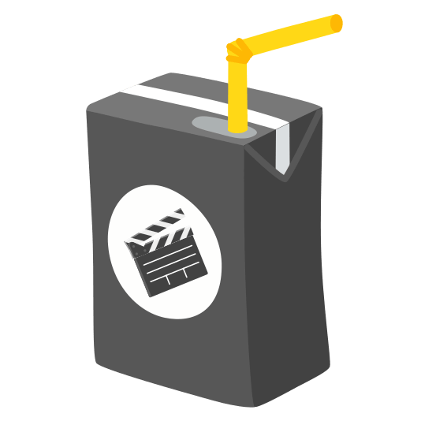

# LinkedIn Feed Blocker Logo

LinkedIn Feed Blocker Logo is a browser extension designed to block the feed on LinkedIn so that you can save yourself from endlessly scrolling and truly focus on what matters.

## Features

- Hides the linkedin feed from apperaing on the homepage.
- Simple and lightweight extension with minimal setup.
- Works seamlessly across various web browsers.

## How to Install

### Google Chrome

1. Download the extension ZIP file from the [latest release](https://github.com/sumanbmondal/linkedin-feed-blocker/releases/latest).
2. Extract the ZIP file to a folder on your computer.
3. Open Google Chrome and navigate to `chrome://extensions`.
4. Enable "Developer mode" using the toggle switch in the top-right corner.
5. Click on the "Load unpacked" button and select the folder where you extracted the extension files.
6. The LinkedIn Feed Blocker extension should now be installed and active in your browser.

### Mozilla Firefox

1. Download the extension ZIP file from the [latest release](https://github.com/sumanbmondal/linkedin-feed-blocker/releases/latest).
2. Extract the ZIP file to a folder on your computer.
3. Open Mozilla Firefox and navigate to `about:debugging#/runtime/this-firefox`.
4. Click on the "Load Temporary Add-on" button.
5. Select any file from the extracted folder (e.g., `manifest.json`).
6. The LinkedIn Feed Blocker extension should now be installed and active in your browser.

### Microsoft Edge

1. Download the extension ZIP file from the [latest release](https://github.com/sumanbmondal/linkedin-feed-blocker/releases/latest).
2. Extract the ZIP file to a folder on your computer.
3. Open Microsoft Edge and navigate to `edge://extensions`.
4. Enable "Developer mode" using the toggle switch in the bottom-left corner.
5. Click on the "Load unpacked" button and select the folder where you extracted the extension files.
6. The LinkedIn Feed Blocker extension should now be installed and active in your browser.

## Contributing

Contributions are welcome! If you have any ideas, suggestions, or bug fixes, feel free to open an issue or submit a pull request.

## License

This project is licensed under the [MIT License](LICENSE).
